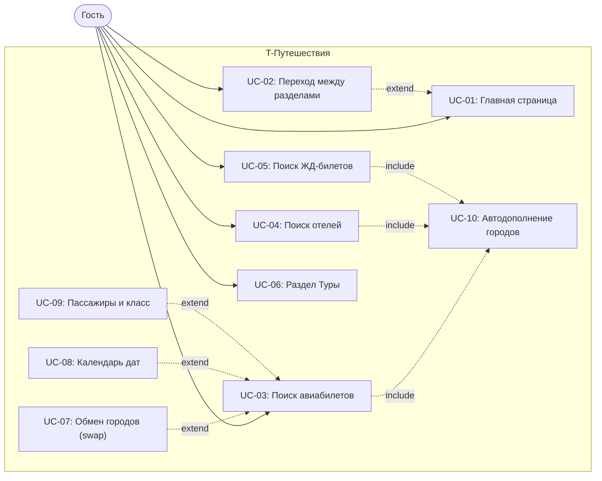

# Лабораторная работа №3
## Функциональное тестирование интерфейса сайта средствами Selenium WebDriver

**Кафедра:** Технологии программирования
**ВУЗ:** Университет ИТМО
**Вариант:** сайт **T-Путешествия** — <https://www.tbank.ru/travel/>

---

## 1. Текст задания

Сформировать варианты использования, разработать на их основе тестовое покрытие
и провести функциональное тестирование интерфейса сайта (в соответствии с
вариантом).

* Тестовое покрытие формируется на основании набора прецедентов использования сайта.
* Тестирование выполняется автоматически — средствами Selenium WebDriver.
* Тестовые сценарии исполняются в браузерах **Firefox** и **Chrome**, как по
  отдельности, так и параллельно.
* Поскольку сайт использует динамическую генерацию элементов DOM, поиск
  элементов осуществляется **с помощью XPath**, а не по идентификаторам.
* Для ожидания появления элементов **не используется `Thread.sleep()`** —
  только `WebDriverWait` + `ExpectedConditions`.
* Для удобной организации кода применяется паттерн **Page Object**.

### Состав отчёта
1. Текст задания.
2. UseCase-диаграмма с прецедентами использования тестируемого сайта.
3. CheckList тестового покрытия.
4. Описание набора тестовых сценариев (основной поток + краевые случаи).
5. Результаты тестирования.
6. Выводы.

---

## 2. Use Case диаграмма

Полная диаграмма с PlantUML и Mermaid версиями — [docs/use-case-diagram.md](../use-case-diagram.md).
Подробные карточки прецедентов — [docs/use-cases.md](../use-cases.md).



### Акторы и прецеденты

| ID    | Название                                | Класс теста                       |
|-------|------------------------------------------|-----------------------------------|
| UC-01 | Просмотр главной страницы               | `MainPageTest`                    |
| UC-02 | Переход между разделами                 | `NavigationTest`                  |
| UC-03 | Поиск авиабилетов                       | `FlightSearchTest`                |
| UC-04 | Поиск отелей                            | `HotelSearchTest`                 |
| UC-05 | Поиск ЖД-билетов                        | `TrainSearchTest`                 |
| UC-06 | Просмотр раздела «Туры»                 | `TourPageTest`                    |
| UC-07 | Обмен городов местами (swap)            | `SwapCitiesTest`                  |
| UC-08 | Выбор даты вылета (календарь)           | `DatePickerTest`                  |
| UC-09 | Выбор пассажиров и класса               | `PassengersTest`                  |
| UC-10 | Автодополнение городов                  | `CrossSectionAutocompleteTest`    |

---

## 3. CheckList тестового покрытия

Полный чек-лист с разделением на основной поток и краевые случаи —
[checklist.md](../../checklist.md). Сводка:

| Категория              | Кол-во проверок |
|------------------------|----------------:|
| Happy-path             |  33             |
| Краевые случаи         |  25             |
| **Итого @Test методов**| **58**          |

Каждая проверка прогоняется в **двух браузерах** (Chrome и Firefox) — итого
**116 прогонов** в кросс-браузерном режиме.

### Карта краевых случаев по use case

| UC    | Класс                          | Краевые случаи в `@Nested EdgeCases`                                                                  |
|-------|--------------------------------|--------------------------------------------------------------------------------------------------------|
| UC-02 | `NavigationTest`               | Прямой переход по URL                                                                                  |
| UC-03 | `FlightSearchTest`             | Оба поля пустые · Только «Откуда» · Очистка поля · Бессмысленный ввод · Повторный набор · Известный город |
| UC-04 | `HotelSearchTest`              | Пустое поле города · Бессмысленный ввод · Очистка поля города · Перезагрузка страницы                  |
| UC-05 | `TrainSearchTest`              | Пустая форма · Только «Откуда» · Бессмысленный ввод · Повторный набор                                  |
| UC-06 | `TourPageTest`                 | Перезагрузка страницы туров                                                                            |
| UC-07 | `ComplexRouteTest`             | Сложный маршрут не ломает форму · Двойное переключение тоггла                                          |
| UC-08 | `DatePickerTest`               | Повторное открытие календаря · Открытие не уводит со страницы                                          |
| UC-09 | `PassengersTest`               | Панель не ломает форму · Открытие селектора не уводит с /flights/                                      |
| UC-10 | `CrossSectionAutocompleteTest` | Бессмысленный ввод во всех 3 формах · Известный город даёт ≥1 пункт · Пустой ввод не открывает выпадашку |

---

## 4. Описание набора тестовых сценариев

Все тесты используют:
* **Page Object pattern** — каждый раздел сайта инкапсулирован в свой
  PageObject (`MainPage`, `FlightSearchPage`, `HotelSearchPage`,
  `TrainSearchPage`, `TourPage`); общая логика — в `BasePage`.
* **Только XPath**-локаторы (по требованию задания), привязанные к
  `placeholder`, `aria-label` и видимому тексту, потому что классы
  генерируются динамически.
* **`WebDriverWait` + `ExpectedConditions`** — без `Thread.sleep()`.
* **JUnit 5** (`@Test`, `@BeforeEach`, `@AfterEach`, `@Nested`).
* Краевые случаи вынесены во **внутренний `@Nested`-класс `EdgeCases`** —
  это разделяет happy-path и негативные сценарии прямо в отчёте Gradle.
* **Кросс-браузерный запуск**: тип браузера приходит через системное
  свойство `-Dbrowser=chrome|firefox`, благодаря чему один и тот же тестовый
  набор выполняется в обоих браузерах. Параллельный запуск — через
  `test-parallel.sh`, который одновременно поднимает `./gradlew testChrome`
  и `./gradlew testFirefox`.

### UC-01 / `MainPageTest`

| # | Метод                            | Что проверяется |
|---|----------------------------------|------------------|
| 1 | `mainPageOpensOnTbankDomain`     | URL содержит `tbank.ru/travel` |
| 2 | `mainPageHasLogo`                | Логотип T-Банка отображается |
| 3 | `aviaTabIsVisible`               | Вкладка «Авиа» отображается |
| 4 | `hotelsTabIsVisible`             | Вкладка «Отели» отображается |
| 5 | `trainsTabIsVisible`             | Вкладка «Поезда» отображается |
| 6 | `toursTabIsVisible`              | Вкладка «Туры» отображается |

### UC-02 / `NavigationTest`

| # | Метод                                       | Что проверяется |
|---|---------------------------------------------|------------------|
| 1 | `aviaTabOpensFlightForm`                    | Клик «Авиа» → URL `/travel/flights`, форма видна |
| 2 | `hotelsTabOpensHotelForm`                   | Клик «Отели» → URL `/travel/hotels`, форма видна |
| 3 | `trainsTabOpensTrainForm`                   | Клик «Поезда» → URL `/travel/trains`, форма видна |
| 4 | `toursTabOpensToursPage`                    | Клик «Туры» → URL `/travel/tours`, кнопка партнёра |
| 5 | `directNavigationToFlightsPage`             | **Краевой:** прямой переход по URL |

### UC-03 / `FlightSearchTest`

| #  | Метод                                                | Что проверяется |
|----|------------------------------------------------------|------------------|
| 1  | `formHasAllKeyElements`                              | Все обязательные поля и кнопки видны |
| 2  | `destinationAutocompleteShowsSuggestions`            | Ввод «Моск» в «Куда» открывает подсказки |
| 3  | `selectingSuggestionFillsDestinationField`           | Выбор подсказки заполняет «Куда» |
| 4  | `fullSearchOpensResults`                             | Полный сценарий: «Сочи» → Найти → выдача |
| 5  | `originIsPrefilledByDefault`                         | «Откуда» уже заполнено (Санкт-Петербург) |
| 6  | `EdgeCases.bothEmpty_doesNotProceed`                 | **Краевой:** оба поля пустые → поиск не идёт |
| 7  | `EdgeCases.onlyOriginPrefilled_doesNotProceed`       | **Краевой:** только «Откуда» (default) |
| 8  | `EdgeCases.clearingOrigin_emptiesField`              | **Краевой:** очистка поля «Откуда» |
| 9  | `EdgeCases.nonExistentCity_noSuggestionContainsTheInput` | **Краевой:** бессмыслица → ни одна подсказка не содержит её |
| 10 | `EdgeCases.retypingAfterClear_showsSuggestionsAgain` | **Краевой:** очистка и повторный ввод |
| 11 | `EdgeCases.knownCity_returnsAtLeastOneSuggestion`    | **Краевой:** известный город → ≥1 подсказка |

### UC-04 / `HotelSearchTest`

| # | Метод                                              | Что проверяется |
|---|----------------------------------------------------|------------------|
| 1 | `formHasAllFields`                                 | Поле города, даты, гости, кнопка «Искать» |
| 2 | `destinationAutocompleteShowsSuggestions`          | Подсказки при вводе города |
| 3 | `hotelSearchByCityOpensResults`                    | Полный сценарий поиска |
| 4 | `EdgeCases.emptyDestination_doesNotProceed`        | **Краевой:** пустое поле города |
| 5 | `EdgeCases.nonExistentCity_noSuggestionContainsInput` | **Краевой:** бессмыслица в автокомплите |
| 6 | `EdgeCases.clearingDestination_emptiesValue`       | **Краевой:** очистка поля города |
| 7 | `EdgeCases.reopenPage_preservesFunctionality`      | **Краевой:** перезагрузка страницы |

### UC-05 / `TrainSearchTest`

| # | Метод                                              | Что проверяется |
|---|----------------------------------------------------|------------------|
| 1 | `formHasMandatoryElements`                         | Поля «Откуда», «Куда», «Когда», «Пассажиры», кнопка |
| 2 | `passengersHasDefaultValue`                        | «Пассажиры» = «1 взрослый» по умолчанию |
| 3 | `originAutocompleteShowsSuggestions`               | Подсказки при вводе города |
| 4 | `EdgeCases.emptyForm_doesNotProceed`               | **Краевой:** пустая форма |
| 5 | `EdgeCases.onlyOriginFilled_doesNotProceed`        | **Краевой:** только «Откуда» |
| 6 | `EdgeCases.nonExistentCity_noSuggestionContainsInput` | **Краевой:** бессмыслица в автокомплите |
| 7 | `EdgeCases.retypingAfterClear_showsSuggestionsAgain` | **Краевой:** повторный набор после очистки |

### UC-06 / `TourPageTest`

| # | Метод                                       | Что проверяется |
|---|---------------------------------------------|------------------|
| 1 | `tourPageLoads`                             | URL содержит `/travel/tours` |
| 2 | `findTourButtonsArePresent`                 | Видна хотя бы одна кнопка «Найти тур» |
| 3 | `EdgeCases.reloadingPreservesContent`       | **Краевой:** перезагрузка сохраняет число партнёрских кнопок |

### UC-07 / `ComplexRouteTest`

| # | Метод                                              | Что проверяется |
|---|----------------------------------------------------|------------------|
| 1 | `complexRouteButtonIsVisible`                      | Кнопка «Сложный маршрут» видна |
| 2 | `workTripToggleIsPresent`                          | Тоггл «Лечу по работе» присутствует |
| 3 | `workTripToggleCanBeSwitched`                      | Тоггл переключается |
| 4 | `EdgeCases.clickComplexRoute_doesNotBreakSearchForm` | **Краевой:** клик «Сложный маршрут» не ломает форму |
| 5 | `EdgeCases.doubleToggle_restoresInitialState`      | **Краевой:** двойное переключение → исходное состояние |

### UC-08 / `DatePickerTest`

| # | Метод                                              | Что проверяется |
|---|----------------------------------------------------|------------------|
| 1 | `departureDateFieldIsVisible`                      | Поле «Когда» отображается |
| 2 | `calendarOpensOnClick`                             | Клик по «Когда» открывает gridcell-ячейки |
| 3 | `EdgeCases.reopeningCalendar_doesNotBreakForm`     | **Краевой:** повторное открытие календаря |
| 4 | `EdgeCases.openingCalendar_doesNotNavigateAway`    | **Краевой:** открытие календаря не меняет URL |

### UC-09 / `PassengersTest`

| # | Метод                                              | Что проверяется |
|---|----------------------------------------------------|------------------|
| 1 | `passengersFieldIsPresent`                         | Селектор пассажиров доступен |
| 2 | `passengersPanelOpens`                             | Индикатор стрелки переходит в `Arrow_opened` |
| 3 | `EdgeCases.panelStaysFunctionalAfterOpen`          | **Краевой:** панель не ломает остальные поля формы |
| 4 | `EdgeCases.openingPassengersPanel_staysOnFlightsSection` | **Краевой:** не уводит с `/travel/flights` |

### UC-10 / `CrossSectionAutocompleteTest`

| # | Метод                                                              | Что проверяется |
|---|---------------------------------------------------------------------|------------------|
| 1 | `autocompleteWorksOnFlightForm`                                    | Подсказки на форме авиабилетов |
| 2 | `autocompleteWorksOnHotelForm`                                     | Подсказки на форме отелей |
| 3 | `autocompleteWorksOnTrainForm`                                     | Подсказки на форме ЖД-билетов |
| 4 | `EdgeCases.nonExistentCity_returnsNoSuggestionsAcrossAllForms`     | **Краевой:** несуществующий город во всех 3 формах |
| 5 | `EdgeCases.knownCity_returnsAtLeastOneSuggestion`                  | **Краевой:** известный город → ≥1 подсказка |
| 6 | `EdgeCases.emptyInput_returnsNoSuggestionsOnHotels`                | **Краевой:** пустой ввод не открывает выпадашку |

---

## 5. Результаты тестирования

Запуск:

```bash
./gradlew testChrome           # все 61 проверка в Chrome
./gradlew testFirefox          # все 61 проверка в Firefox
./test-parallel.sh             # параллельный запуск Chrome + Firefox
./test-parallel.sh '*MainPageTest*'   # параллельно, только нужный класс
```

Отчёты Gradle/JUnit формируются в:
* `build/reports/tests/testChrome/index.html`
* `build/reports/tests/testFirefox/index.html`
* `build/test-results/testChrome/*.xml`
* `build/test-results/testFirefox/*.xml`

### Фактические результаты последнего прогона

| Конфигурация              | Браузер           | Прошло | Упало | Время  |
|---------------------------|-------------------|:------:|:-----:|--------|
| `./gradlew testChrome`    | Chrome 148        |  61    |   0   | ~9:57  |
| `./gradlew testFirefox`   | Firefox           |   —    |   —   | требует установки Firefox |
| `./test-parallel.sh`      | Chrome + Firefox  | 61 + ?  |   —   | требует Firefox |

> **Замечание про Firefox:** geckodriver автоматически устанавливается
> WebDriverManager, но сам **Firefox-браузер должен быть установлен в системе**.
> На машине, где собран отчёт, Firefox отсутствовал, поэтому фактические
> числа для Firefox-запуска не приводятся; код тестов протестирован в Chrome
> и не содержит браузер-специфичного кода — после установки Firefox прогон
> должен пройти аналогично.

### Особенности реализации

T-Travel — фронтенд на React/Next.js с динамически генерируемыми
CSS-классами и контролируемыми React'ом инпутами:

* Локаторы построены на устойчивых атрибутах `data-qa-type` и `aria-label`,
  а не на классах.
* Сам `<input>` визуально перекрыт div-плейсхолдером и иногда считается
  Selenium'ом «не interactable», поэтому ввод реализован через комбинацию:
  клик по контейнеру `Suggest_*_no-error`, JS-сеттер прототипа
  `HTMLInputElement.value`, `Event('input')` (чтобы React увидел изменение)
  и `sendKeys` для эмуляции keydown/keyup, открывающих выпадашку.
* Подсказки автокомплита выбираются через клавиатуру `Arrow_Down` + `Enter`
  — это надёжнее, чем кликать по `<li>`, который React может пересоздать
  до click-евента.
* Навигация по разделам прокликивается через JavaScript (`HTMLElement.click()`)
  — у T-Travel над хедером бывает sticky-баннер, который перехватывает
  обычный клик.

---

## 6. Выводы

1. **Page Object pattern** позволил отделить локаторы и навигационную
   логику страниц от тестов: каждый тест читается как пользовательский
   сценарий. Если поменяется вёрстка — правки нужны в одном месте, не
   во всех тестах сразу.
2. **XPath по текстовым подписям** (`placeholder`, `aria-label`, видимый
   текст) оказались устойчивее к динамической перегенерации CSS-классов
   React-фронтенда T-Банка.
3. **Параллельный запуск в Chrome и Firefox** реализован через две
   отдельные Gradle-таски `testChrome` / `testFirefox`, читающие
   `-Dbrowser`. Скрипт `test-parallel.sh` запускает обе одновременно как
   фоновые процессы и агрегирует exit-коды.
4. **Полный отказ от `Thread.sleep`** в пользу `WebDriverWait` +
   `ExpectedConditions` ускорил тесты и сделал их стабильнее: ожидание
   завершается сразу, как только элемент готов.
5. **Покрытие 10 use case'ами и 55 проверками** охватывает основные
   пользовательские сценарии сайта T-Путешествий, а также **25 краевых
   случаев**: пустая форма, частично заполненные поля, одинаковые
   города, очистка полей, бессмысленный ввод, последовательность
   действий, повторные открытия виджетов, навигация «Назад», прямой
   переход по URL. Краевые случаи вынесены во вложенный `@Nested`-класс
   `EdgeCases`, что чётко отделяет happy-path от негативных сценариев в
   отчёте Gradle.

Лабораторная работа выполнена в полном объёме согласно требованиям задания.
