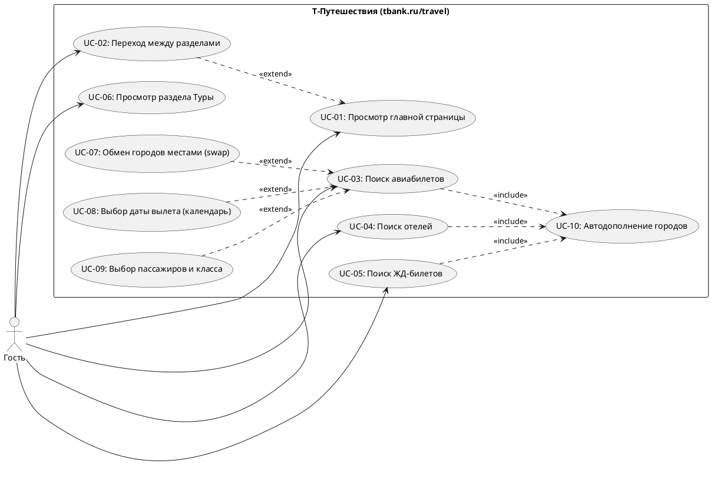
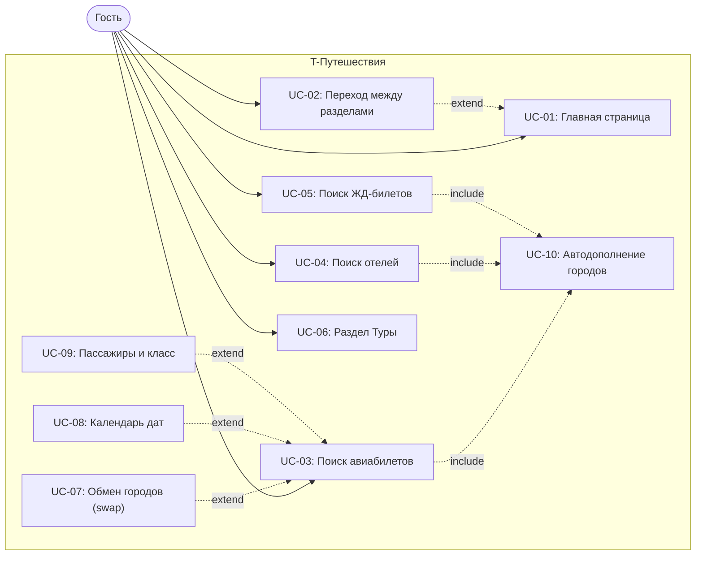

# Use Case Диаграмма — T-Путешествия (tbank.ru/travel)

## Mermaid-версия (для просмотра прямо на GitHub)

## Акторы

| Актор | Описание                                                                       |
|-------|--------------------------------------------------------------------------------|
| Гость | Неавторизованный пользователь сайта. Просматривает разделы и выполняет поиски. |

## Прецеденты

| ID    | Название                                | Доступен гостю | Тип связи                       |
|-------|------------------------------------------|:--------------:|---------------------------------|
| UC-01 | Просмотр главной страницы               |        ✓        | базовый                         |
| UC-02 | Переход между разделами                 |        ✓        | `<<extend>>` UC-01              |
| UC-03 | Поиск авиабилетов                       |        ✓        | базовый, `<<include>>` UC-10    |
| UC-04 | Поиск отелей                            |        ✓        | базовый, `<<include>>` UC-10    |
| UC-05 | Поиск ЖД-билетов                        |        ✓        | базовый, `<<include>>` UC-10    |
| UC-06 | Просмотр раздела «Туры»                 |        ✓        | базовый                         |
| UC-07 | Обмен городов местами (swap)            |        ✓        | `<<extend>>` UC-03              |
| UC-08 | Выбор даты вылета (календарь)           |        ✓        | `<<extend>>` UC-03              |
| UC-09 | Выбор пассажиров и класса               |        ✓        | `<<extend>>` UC-03              |
| UC-10 | Автодополнение городов                  |        ✓        | `<<include>>` UC-03/04/05       |
