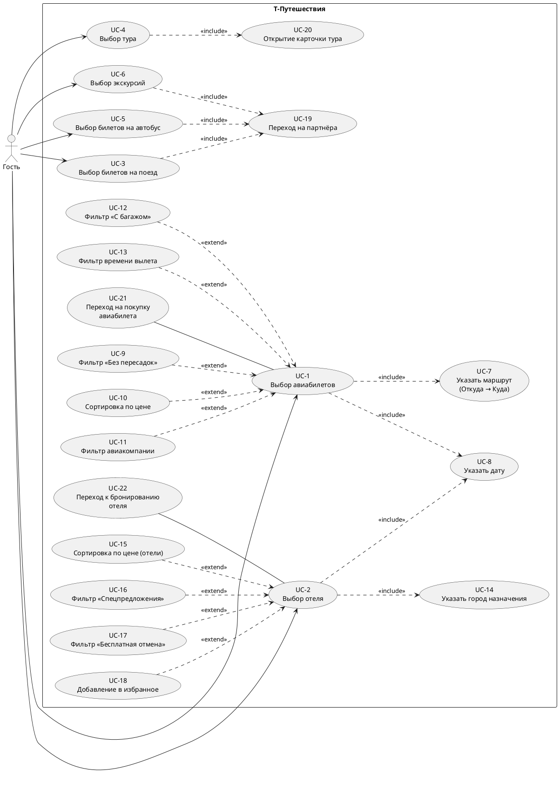
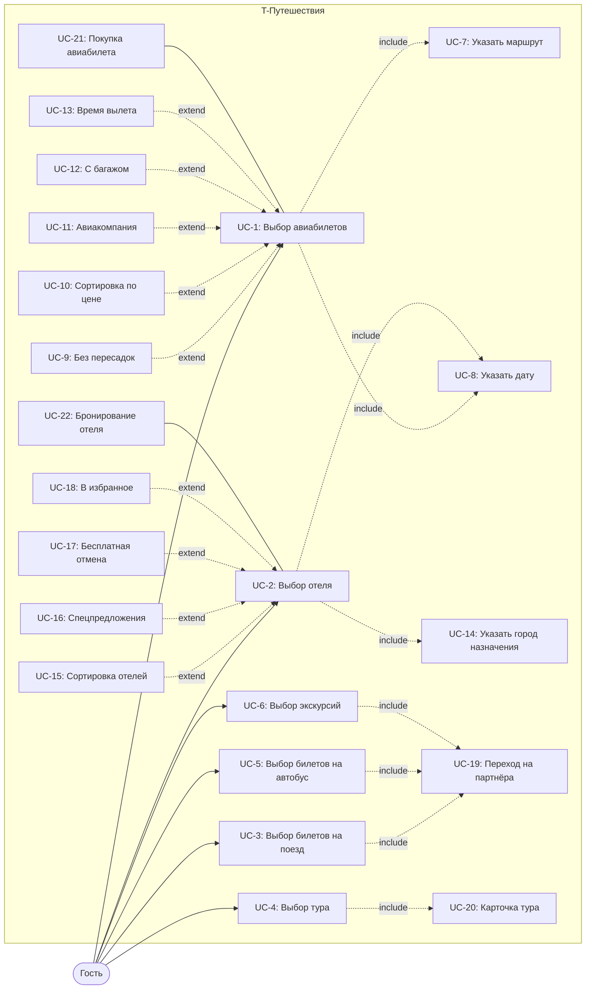

# Use Case диаграмма — T-Путешествия (tbank.ru/travel)

## Акторы

| Актор | Описание                                                                                                                          |
|-------|-----------------------------------------------------------------------------------------------------------------------------------|
| Гость | Неавторизованный пользователь сайта. Просматривает разделы, использует фильтры, переходит в карточки и на партнёрские страницы.   |

## Прецеденты

| ID    | Название                          | Тип       | Связи                                                                                       |
|-------|-----------------------------------|-----------|---------------------------------------------------------------------------------------------|
| UC-1  | Выбор авиабилетов                 | базовый   | `<<include>>` UC-7, UC-8; `<<extend>>` ← UC-9, UC-10, UC-11, UC-12, UC-13; ассоциация — UC-21 |
| UC-2  | Выбор отеля                       | базовый   | `<<include>>` UC-14, UC-8; `<<extend>>` ← UC-15, UC-16, UC-17, UC-18; ассоциация — UC-22      |
| UC-3  | Выбор билетов на поезд            | базовый   | `<<include>>` UC-19                                                                          |
| UC-4  | Выбор тура                        | базовый   | `<<include>>` UC-20                                                                          |
| UC-5  | Выбор билетов на автобус          | базовый   | `<<include>>` UC-19                                                                          |
| UC-6  | Выбор экскурсий                   | базовый   | `<<include>>` UC-19                                                                          |
| UC-7  | Указать маршрут (Откуда → Куда)   | include   | входит в UC-1                                                                                |
| UC-8  | Указать дату                      | include   | входит в UC-1, UC-2                                                                          |
| UC-9  | Фильтр «Без пересадок»            | extend    | расширяет UC-1                                                                               |
| UC-10 | Сортировка по цене (авиа)         | extend    | расширяет UC-1                                                                               |
| UC-11 | Фильтр по авиакомпании            | extend    | расширяет UC-1                                                                               |
| UC-12 | Фильтр «С багажом»                | extend    | расширяет UC-1                                                                               |
| UC-13 | Фильтр времени вылета             | extend    | расширяет UC-1                                                                               |
| UC-14 | Указать город назначения (отели)  | include   | входит в UC-2                                                                                |
| UC-15 | Сортировка по цене (отели)        | extend    | расширяет UC-2                                                                               |
| UC-16 | Фильтр «Спецпредложения»          | extend    | расширяет UC-2                                                                               |
| UC-17 | Фильтр «Бесплатная отмена»        | extend    | расширяет UC-2                                                                               |
| UC-18 | Добавление отеля в избранное      | extend    | расширяет UC-2                                                                               |
| UC-19 | Переход на партнёрский сайт       | include   | входит в UC-3, UC-5, UC-6                                                                    |
| UC-20 | Открытие карточки тура у партнёра | include   | входит в UC-4                                                                                |
| UC-21 | Переход на покупку авиабилета     | ассоциация | связан с UC-1 (`/travel/flights/checkout/`)                                                 |
| UC-22 | Переход к бронированию отеля      | ассоциация | связан с UC-2 (`/travel/hotels/new/checkout`)                                               |

**Правило связей:**
- `<<include>>` — обязательное действие, без него базовый сценарий не имеет смысла (например, нельзя «получить рейсы», не указав маршрут).
- `<<extend>>` — необязательная опция, фильтр или дополнительное действие, которое пользователь может применить.

## PlantUML

## Mermaid-версия (для GitHub)

